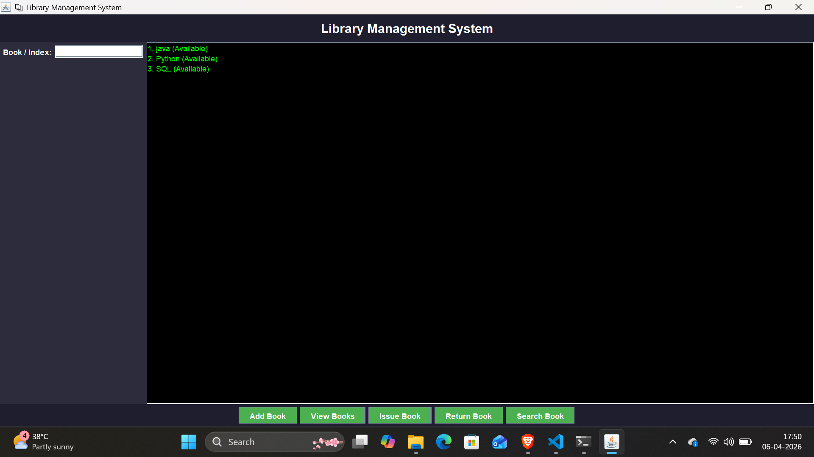
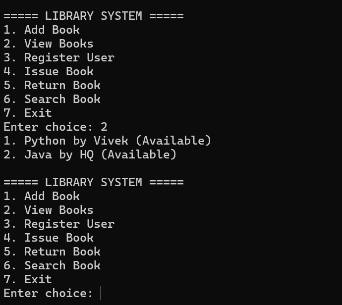

# 📚 Java Library Management System

## 📌 Project Overview

This project is a Library Management System built using Core Java and OOP concepts. It is designed to handle book management, user records, and transactions efficiently.

The system includes both a **console-based version (CLI)** and a **GUI version using Java Swing**, providing flexibility in how users interact with the application.

---

## 🚀 Features

### 📘 Book Management

* Add, update, and remove books
* View all books with availability status

### 👤 User Management

* Register users
* Issue books to users
* Track issued books

### 🔄 Transactions

* Issue books with a **7-day due date**
* Return books
* Automatic **fine calculation** for late returns

### 🔍 Search System

* Search books by title, author, or issued user

### 🖥️ Interface

* CLI (console-based system)
* GUI (Java Swing interface)

---

## 🛠️ Technologies Used

* Java (Core Java & OOP concepts)
* Java Swing (GUI development)
* ArrayList (in-memory data storage)
* LocalDate API (date handling)

---

## 📸 Screenshots

### 🖥️ GUI Interface



### 💻 CLI Version



---

## ▶️ How to Run

### 🔹 CLI Version

```bash
javac Main.java
java Main
```

### 🔹 GUI Version

```bash
javac LibraryGUI.java
java LibraryGUI
```

---

## 📌 Future Improvements

* Database integration using MySQL and JDBC
* User authentication (Admin/User login)
* Persistent data storage
* Web-based version of the system

---

## 👨‍💻 Author

**Vivek Gupta**

---

## ⭐ Project Status

✔ Fully functional
✔ CLI + GUI implemented
✔ Core features completed
